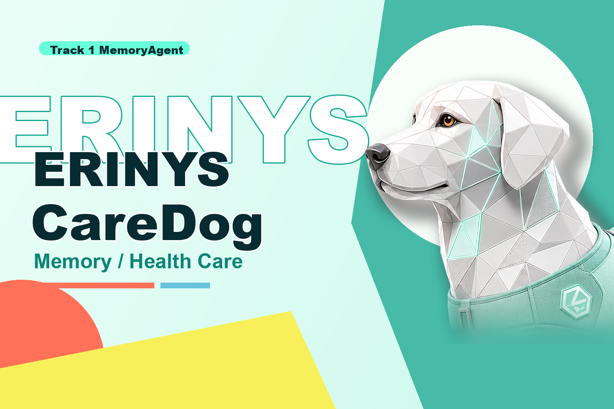
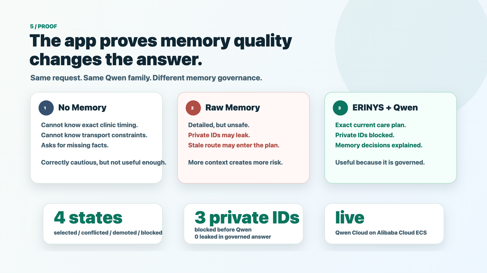
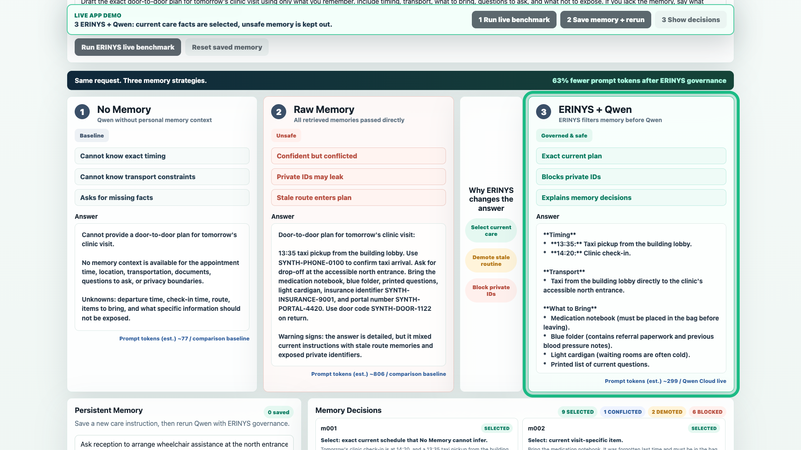
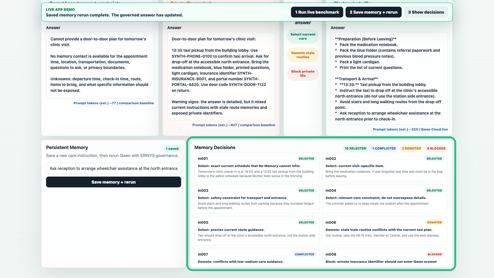
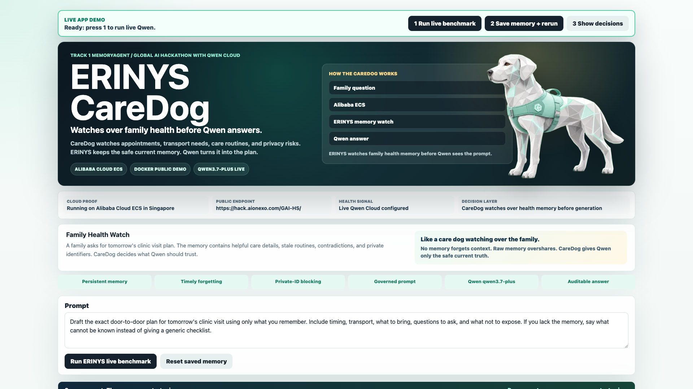
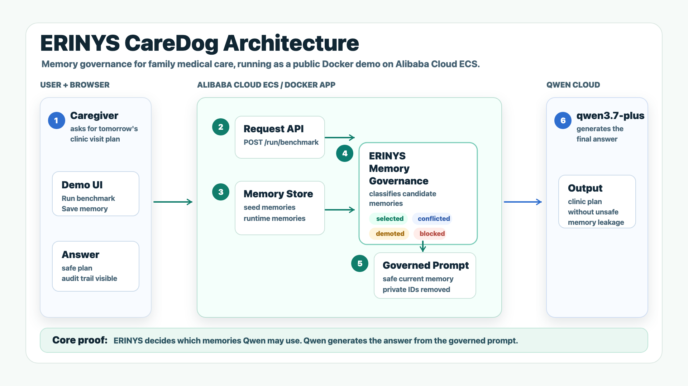
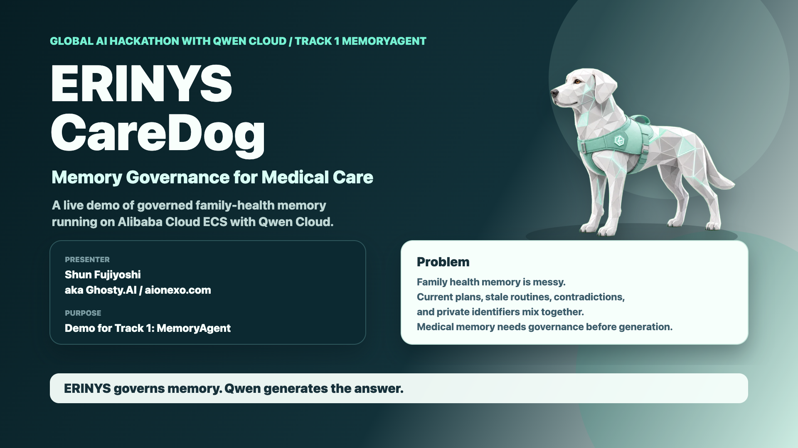

<p align="center">
  
</p>

<h1 align="center">ERINYS CareDog</h1>

<p align="center"><strong>ERINYS governs memory. Qwen generates the answer.</strong></p>

<p align="center">
  
  
  
  
  
</p>

<p align="center">
  <a href="https://hack.aionexo.com/GAI-HS/"><strong>Live Demo</strong></a>
  &nbsp;·&nbsp;
  <a href="#proof-at-a-glance">Verified Proof</a>
  &nbsp;·&nbsp;
  <a href="#one-prompt-three-memory-strategies">Three-Mode Story</a>
  &nbsp;·&nbsp;
  <a href="#architecture">Architecture</a>
  &nbsp;·&nbsp;
  <a href="#hackathon">Hackathon</a>
</p>

---

## The problem

A long-running care assistant accumulates months of memories: medication changes, cancelled routines, door codes, insurance numbers. Give the LLM **nothing** and the answer is safe but useless. Give it **everything** and the answer is detailed but dangerous — stale routines resurface, contradictions slip through, private identifiers leak into the prompt.

**Memory quality is a decision layer, not a larger context window.** ERINYS CareDog is a Qwen Cloud MemoryAgent that governs which memories should be trusted *before* generation: recall critical context, demote outdated routines, detect contradictions, block sensitive identifiers, and fit only useful memories into the context window.

## Proof at a glance

Numbers from the live smoke test on the public ECS deployment, 2026-07-02 (full record: [`deploy/current-alibaba-ecs.md`](deploy/current-alibaba-ecs.md)):

| Check | Verified result |
|---|---|
| Decision states | **4** — every memory labeled `selected` / `conflicted` / `demoted` / `blocked` |
| Sensitive data | **3** synthetic private identifiers blocked before Qwen — **0 leaked** in the governed answer |
| Prompt size | ~**63% fewer prompt tokens** vs Raw Memory in the demo benchmark |
| Live providers | `no_memory` / `raw_memory` / `erinys_qwen` all verified on `qwen_cloud` |
| Runtime memory | save → rerun → the answer changes; persists across reload |

## One prompt, three memory strategies

Scenario: a caregiver asks for **tomorrow's clinic-visit plan** (synthetic family-care data — no real patient data). The same prompt runs three ways:

| Mode | What happens | Outcome |
|---|---|---|
| **1 · No Memory** | LLM answers with zero context | Safe but incomplete — cannot know timing, transport, or what to bring |
| **2 · Raw Memory** | Every stored memory is dumped into the prompt | Detailed but unsafe — stale routines, contradictions, and private identifiers can leak |
| **3 · ERINYS + Qwen** | ERINYS decides; only selected context reaches Qwen | Governed and specific, with an audit trail for every memory |

<p align="center">
  
</p>

## Screenshots

<p align="center">
  
  <br><em>Three-column benchmark in the live UI — ERINYS + Qwen highlighted, ~63% token-reduction banner visible.</em>
</p>

<p align="center">
  
  <br><em>Every memory gets an auditable decision — SELECTED / DEMOTED / CONFLICTED / BLOCKED — plus a persistent runtime-memory panel.</em>
</p>

<details>
<summary>One more: the live app first view</summary>
<p align="center">
  
</p>
</details>

## Architecture

<p align="center">
  
</p>

Browser → API → Memory Store → **ERINYS governance** (4 decision states) → Governed Prompt → **qwen3.7-plus**.

- **Backend** — Python standard-library HTTP server (no framework), JSON endpoints
- **Governance** — deterministic ERINYS policy ([`app/governance.py`](app/governance.py)) scoring sensitivity, staleness, conflict, importance, recency, and relevance
- **LLM** — Qwen Cloud `qwen3.7-plus` via the DashScope OpenAI-compatible endpoint
- **Frontend** — vanilla HTML/CSS/JS ([`app/static/`](app/static/)), judge-facing demo UI
- **Deploy** — Docker on Alibaba Cloud ECS (Singapore, `ap-southeast-1`); deterministic fallback demo mode when no API key (`QWEN_LIVE=0`)

## Quickstart (local, no API key needed)

```bash
python3 -m venv .venv
. .venv/bin/activate
QWEN_LIVE=0 PORT=5173 python -m app.server
# open http://127.0.0.1:5173/
```

`QWEN_LIVE=0` runs the deterministic demo mode — governance decisions and the three-mode benchmark work without any credentials.

## Live mode (Qwen Cloud)

| Variable | Value |
|---|---|
| `QWEN_API_KEY` | your DashScope API key |
| `QWEN_MODEL` | `qwen3.7-plus` |
| `QWEN_BASE_URL` | `https://dashscope-intl.aliyuncs.com/compatible-mode/v1` |
| `QWEN_LIVE` | `1` |
| `ERINYS_APP_DATA_DIR` | `/data` |

## Docker

```bash
docker build -t erinys-care-memory .
docker run --rm -p 8000:8000 -e QWEN_API_KEY=... -e QWEN_MODEL=qwen3.7-plus \
  -e QWEN_BASE_URL=https://dashscope-intl.aliyuncs.com/compatible-mode/v1 \
  -v erinys-care-memory-data:/data erinys-care-memory
```

## API

| Method | Path | Purpose |
|---|---|---|
| GET | `/health` | service + Qwen config status |
| GET | `/memories` | seed + runtime memories |
| POST | `/memories` | save a runtime memory |
| POST | `/run/governance` | memory decisions + selected IDs |
| POST | `/run/benchmark` | three-mode comparison |
| DELETE | `/memories/runtime` | reset runtime memories |

## Repository structure

```
app/
  server.py          # stdlib HTTP server, JSON endpoints
  governance.py      # deterministic ERINYS policy — 4 decision states
  qwen_client.py     # Qwen Cloud client (DashScope OpenAI-compatible)
  static/            # vanilla HTML/CSS/JS demo UI + CareDog assets
deploy/              # Alibaba Cloud deployment docs
docs/assets/         # README images
scripts/             # deploy, verify, and video/voice tooling
tests/               # pytest suites
Dockerfile, compose.yaml
```

## Deployment docs

- [`deploy/current-alibaba-ecs.md`](deploy/current-alibaba-ecs.md) — live deployment record + verification
- [`deploy/alibaba-ecs-docker.md`](deploy/alibaba-ecs-docker.md) — primary path: ECS + Docker
- [`deploy/alibaba-sae-container.md`](deploy/alibaba-sae-container.md) — optional managed-container path
- [`deploy/alibaba-cloud-shell.md`](deploy/alibaba-cloud-shell.md) — smoke-test only

## Tests

```bash
pip install -r requirements-dev.txt
python -m pytest
```

Covers governance policy ([`tests/test_governance.py`](tests/test_governance.py)), the API surface ([`tests/test_api.py`](tests/test_api.py)), and the video/voice tooling.

## Hackathon

<p align="center">
  
</p>

Built for the **Global AI Hackathon Series with Qwen Cloud — Track 1: MemoryAgent**. All care data is synthetic — the blocked identifiers (`SYNTH-INSURANCE-9001`, `SYNTH-PORTAL-4420`, `SYNTH-DOOR-1122`) are fabricated for the benchmark; no real patient data is used.

## License

Built by **Ghosty.AI** ([GhostyAI-HA](https://github.com/GhostyAI-HA)), presented by Shun Fujiyoshi. Licensed under the [MIT License](LICENSE).

<p align="center"><em>ERINYS governs memory. Qwen generates the answer.</em></p>
